<link href="https://fonts.googleapis.com/css?family=Montserrat&display=swap" rel="stylesheet">

<style>
slides > slide {
  font-family: 'Montserrat', sans-serif;
}

.center {
  display: block;
  margin-left: auto;
  margin-right: auto;

}


</style>


```{r setup, include=FALSE}
library(knitr)
library(rgl)
library(ggplot2)
library(plotly)
library(dplyr)
library(patchwork)
library(ggthemes)
opts_chunk$set(echo = FALSE, message = FALSE, warning = FALSE)
options(scipen=999)  # turn-off scientific notation like 1e+48
theme_set(theme_bw())  # pre-set the bw theme.
```

## Outline

1. Compound identification
2. Identification of spectra

## O mnie

Michał Burdukiewicz:

 - bioinformatyk (UMB, IBB PAN, BTU Cottbus-Senftenberg),
 - 12 lat doświadczenia z R,
 - Stowarzyszenie Wrocławskich Użytkowników R (stwur.pl),
 - Fundacja Why R? (whyr.pl).

Mail: michalburdukiewicz@gmail.com

## O mnie

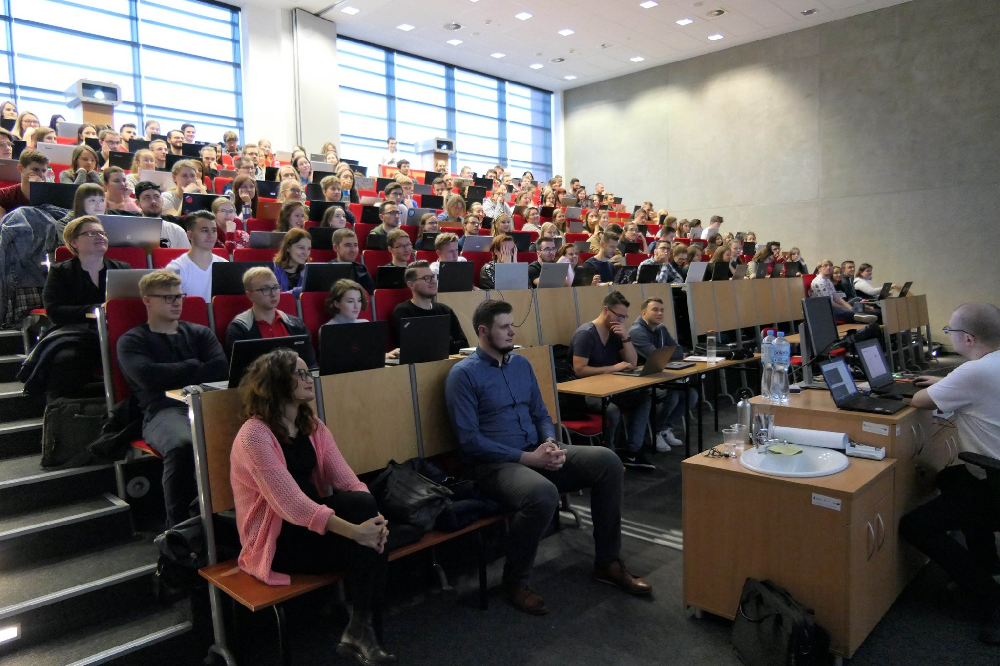

## O mnie

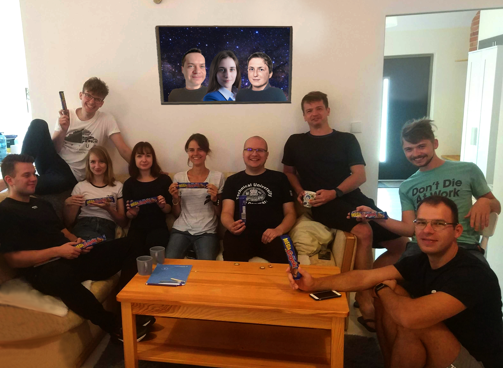

# Compound identification

## Compound identification in metabolomics

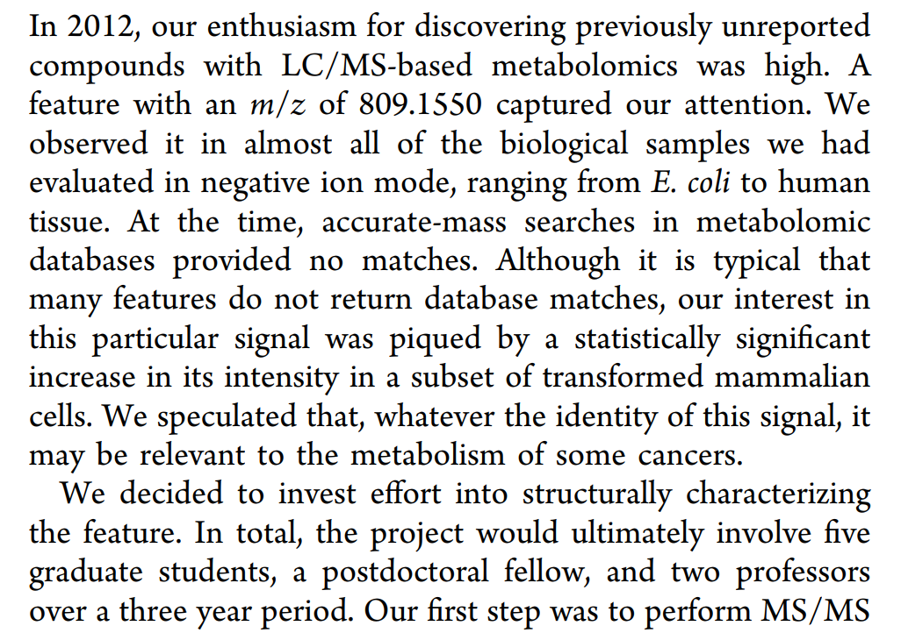

Sindelar, M., and Patti, G.J. (2020). Chemical Discovery in the Era of Metabolomics. J. Am. Chem. Soc. 142, 9097–9105.

## Compound identification in metabolomics

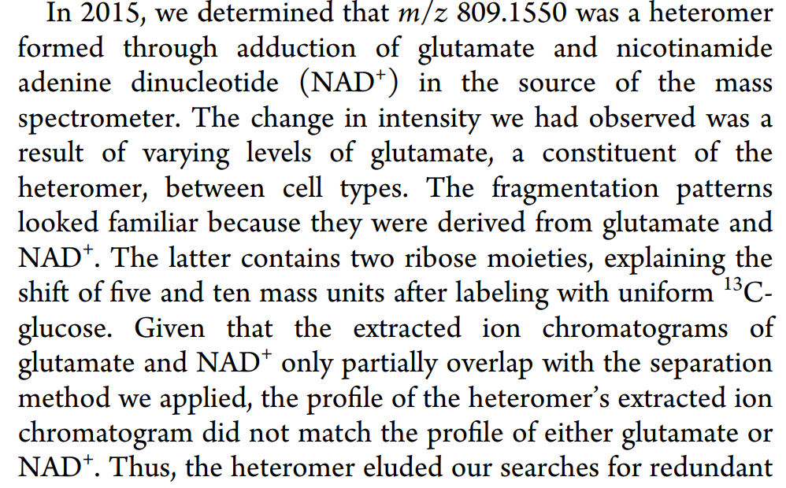

Sindelar, M., and Patti, G.J. (2020). Chemical Discovery in the Era of Metabolomics. J. Am. Chem. Soc. 142, 9097–9105.

## Fragmentation

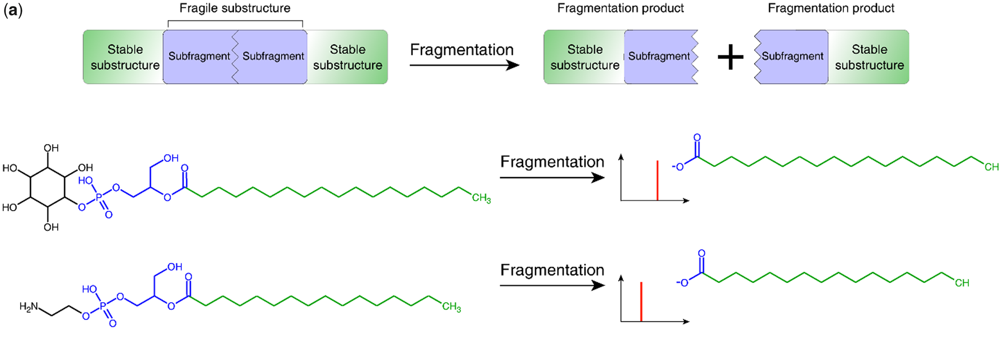

Li, Y., Kuhn, M., Gavin, A.-C., and Bork, P. (2020). Identification of metabolites from tandem mass spectra with a machine learning approach utilizing structural features. Bioinformatics 36, 1213–1218.

## Fragmentation

```{r}
library(InterpretMSSpectrum)
utils::data(apci_spectrum, package = "InterpretMSSpectrum")
PlotSpec(x=apci_spectrum, ionization="APCI")
```

Mass spectrum of L-Glutamic acid (3TMS) measured on a Bruker impact II. 

## Challenges in compound identification

 - complex identification of structural isomers.

## Complex identification of structural isomers

```{r}
library(InterpretMSSpectrum)
utils::data(apci_spectrum, package = "InterpretMSSpectrum")
PlotSpec(x=apci_spectrum, ionization="APCI")
```

Mass spectrum of D-Glutamic acid (3TMS) measured on a Bruker impact II. 

## Challenges in compound identification

 - hard to identify structural isomers,
 - instrument-dependent fragmentation patterns.

## Inter-instrument transferability

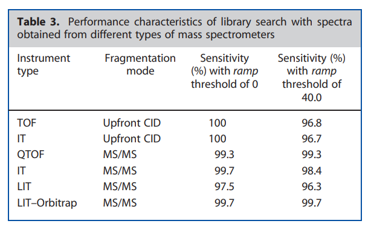

Oberacher, H., Pitterl, F., Siapi, E., Steele, B.R., Letzel, T., Grosse, S., Poschner, B., Tagliaro, F., Gottardo, R., Chacko, S.A., et al. (2012). On the inter-instrument and the inter-laboratory transferability of a tandem mass spectral reference library. 3. Focus on ion trap and upfront CID. Journal of Mass Spectrometry 47, 263–270.

## Challenges in compound identification

 - hard to identify structural isomers,
 - instrument-dependent fragmentation patterns,
 - complex relationship between molecular structure and fragmentation spectra.
 
## Connecting molecular structure and fragmentation spectra
 

# Identification of spectra

## Spectral databases

Databases: MassBank, MoNAi, METLIN and mzCloud.

Different search algorithms allow searching spectral databases with various levels of sensitivity and specificity.
 
## Databases

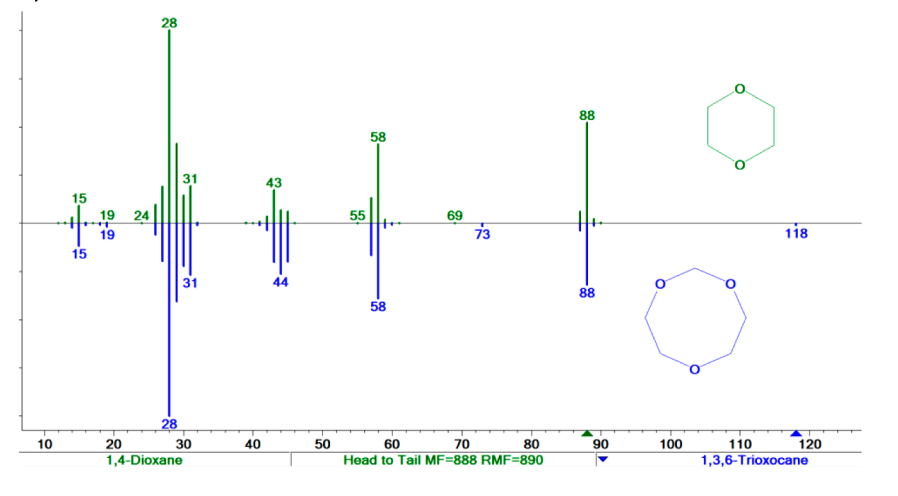

Two compounds yielding the same set of ions at the same intensities due to similarity in structure and fragmentation pathways.

Stein, S. (2012). Mass Spectral Reference Libraries: An Ever-Expanding Resource for Chemical Identification. Anal. Chem. 84, 7274–7282.

## Databases

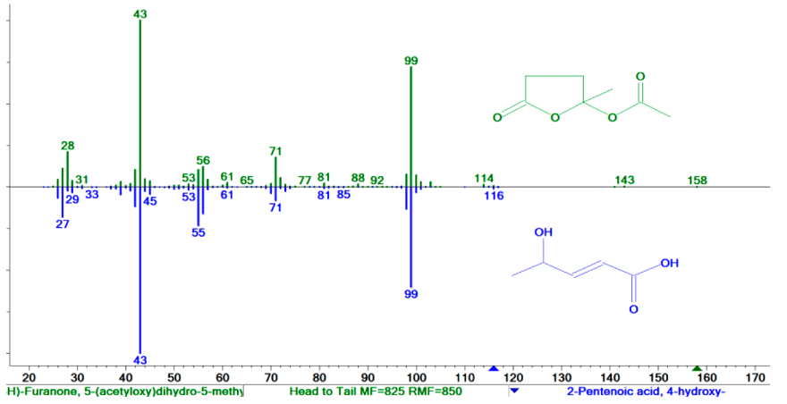

Entirely different structures yielding ions of the same formulas,

Stein, S. (2012). Mass Spectral Reference Libraries: An Ever-Expanding Resource for Chemical Identification. Anal. Chem. 84, 7274–7282.

## Databases

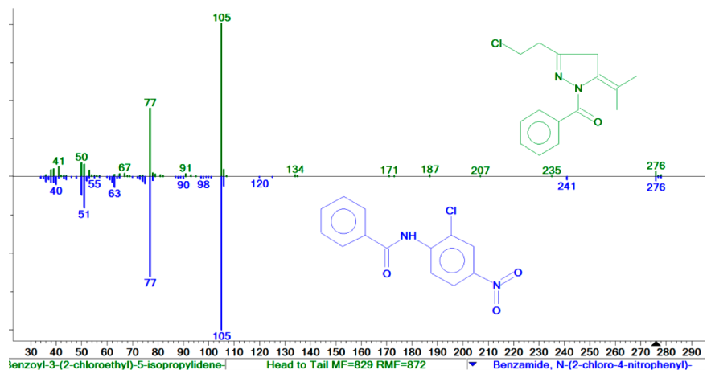

The same low mass ions from a substructure in common (benzoyl) for two very different precursor molecules.

Stein, S. (2012). Mass Spectral Reference Libraries: An Ever-Expanding Resource for Chemical Identification. Anal. Chem. 84, 7274–7282.

## Databases

"Only 1.8% of spectra in an untargeted metabolomics experiment can be annotated."

Silva, R.R. da, Dorrestein, P.C., and Quinn, R.A. (2015). Illuminating the dark matter in metabolomics. PNAS 112, 12549–12550.

# Computational approaches for compound identification

## Main approaches

```{r}
expand.grid(x = c("From compound to spectra\n", "From spectra to compound\n"),
            y = c("Quantum chemistry", "Combinatorial optimization methods",
                  "Heuristic-based methods", "Machine learning models")) %>% 
  mutate(lab = c("QCEIMS", "", 
                 "MIDAS-G, MetFrag, MAGMa+", "SIRIUS",
                 "Mass Frontier, LipidBlast,\nLipidMatch", "Lipid Data Analyzer, LipidXplorer",
                 "CFM-ID., NEIMS", "FingerID, DeepEI")) %>% 
  ggplot(aes(x = x, y = y, label = lab)) +
  geom_tile(fill = NA, color = "black") +
  geom_text() +
  theme_void() +
  theme(axis.text = element_text(color = "black"))
```


## Quantum chemistry

QCEIMS: \textit{ab initio} Born-Oppenheimer molecular dynamics.

Weakness: computational cost.

Ásgeirsson, V., Bauer, C.A., and Grimme, S. (2017). Quantum chemical calculation of electron ionization mass spectra for general organic and inorganic molecules. Chem. Sci. 8, 4879–4895.

## Combinatorial optimization methods

Enumerate all possible fragments of candidate structures by systematic bond cleavage.

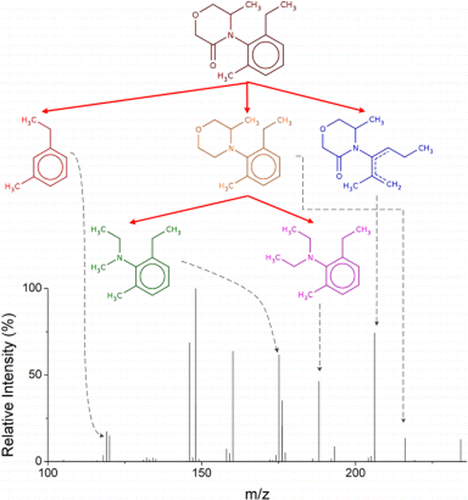

E.g., MIDAS-G, MetFrag, MAGMa+.

## Heuristic-based methods

Use simulated fragmentation libraries to define rules of fragmentation for highly similar compounds.

E.g., Mass Frontier, LipidBlast, LipidMatch.

## Machine learning methods

Fragmentation can be seen as a stochastic homogeneous Markov process (e.g., CFM-ID., NEIMS.

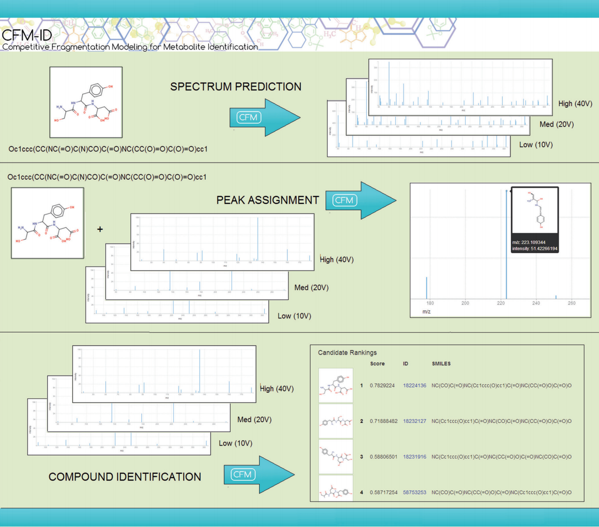

